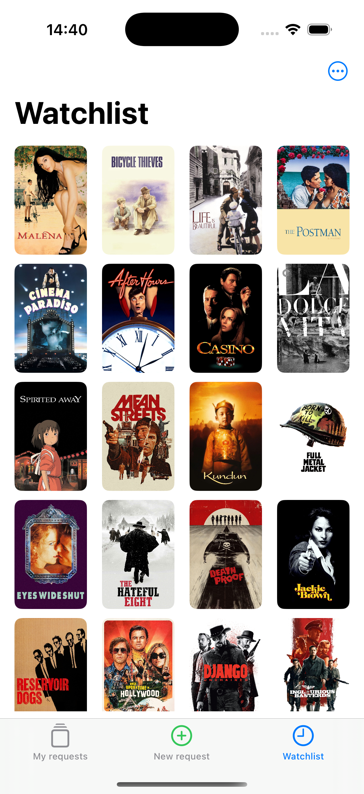
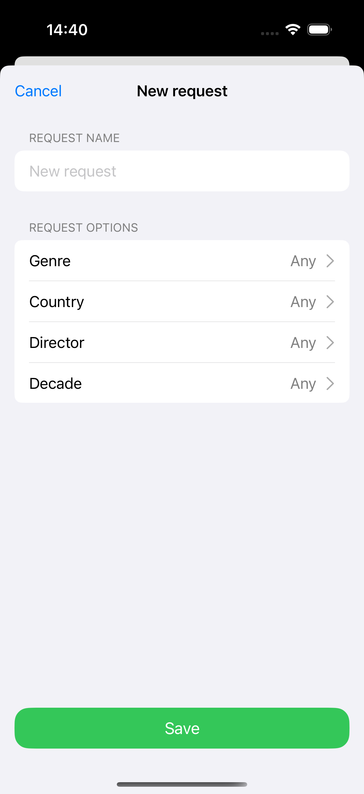
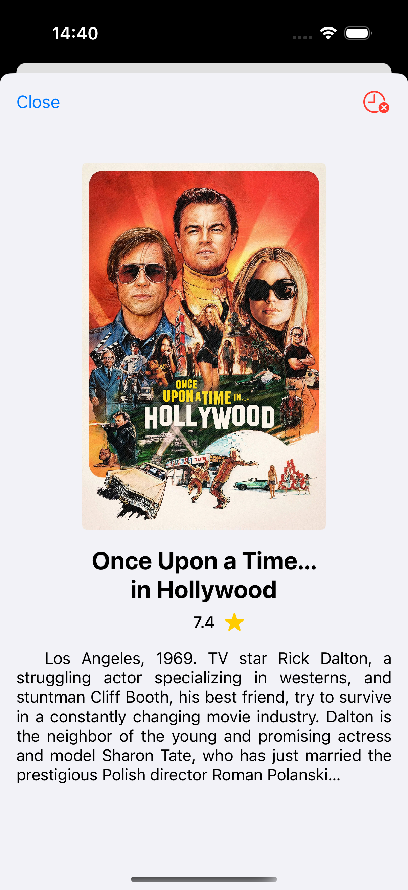

# 🎬FilmRec
FilmRec is a movie recommendation iOS application built with UIKit and MVVM architecture. It integrates OpenAI and TMDB APIs to generate personalized movie recommendations.

## ✨Features
- 🤖Movie recommendations using OpenAI API
- 🎥Fetching movie data from TMDB API
- 💾Local data persistence with Core Data
- 🧱MVVM architecture

## 🛠 Tech Stack
**Language:** Swift<br>
**UI:** UIKit<br>
**Architecture:** MVVM<br>
**Networking:** URLSession, REST API, JSON<br>
**Persistence:** Core Data<br>
**Tools:** Git, SPM

## 📱Screenshots
<p>
  
  
</p>

<p>
  
  
</p>

## 🎨 Design
The UI/UX design was created in Figma: 👉 [Open Figma Prototype](https://www.figma.com/design/b6vfxwMhYjGdfGzjx1MoWb/FilmRec?node-id=0-1&t=m7GkbtizJumF8JU8-1)

## 🚀 Installation
1. Clone the repository
2. Open the project in Xcode
3. Create a Constants.swift file and add your API keys:<br>
```
enum Constants {
    static let openAIAPIKey = "YOUR_OPENAI_API_KEY"
    static let tmdbAPIAccessToken = "YOUR_TMDB_ACCESS_TOKEN"
    static let openAIResponseURL = "https://api.openai.com/v1/responses"
    static let tmdbSearchURL = "https://api.themoviedb.org/3/search/movie"
    static let tmdbFilmIDURL = "https://api.themoviedb.org/3/movie"
}
```
4. Run the project on a simulator or device (iOS 15.6+) **with VPN enabled**

## 📫 Contact
E-mail: alnepryakhin@gmail.com<br>
Telegram: https://t.me/nizyashka<br>
GitHub: https://github.com/nizyashka<br>
