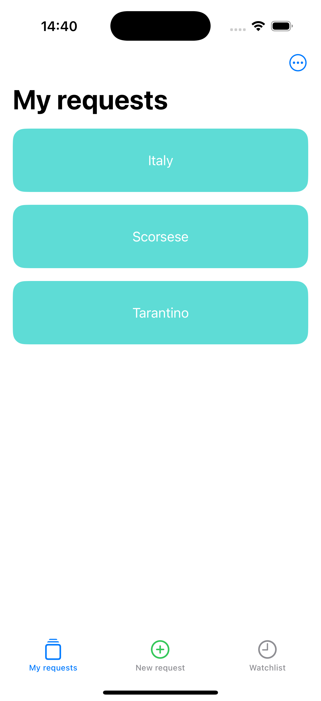

# 🎬FilmRec
---
FilmRec is a movie recommendation iOS application built with UIKit and MVVM architecture. It integrates OpenAI and TMDB APIs to generate personalized movie recommendations.

## ✨Features
---
- 🤖Movie recommendations using OpenAI API
- 🎥Fetching movie data from TMDB API
- 💾Local data persistence with Core Data
- 🧱Clean MVVM architecture

## 🛠 Tech Stack
---
**Language:** Swift
**UI:** UIKit
**Architecture:** MVVM
**Networking:** URLSession, REST API, JSON
**Persistence:** Core Data
**Tools:** Git, SPM

## 📱Screenshots
---

## 🎨 Design
---
The UI/UX design was created in Figma:  
👉 [Open Figma Prototype](https://www.figma.com/design/b6vfxwMhYjGdfGzjx1MoWb/FilmRec?node-id=0-1&t=m7GkbtizJumF8JU8-1)

## 🚀 Installation
---
1. Clone the repository
2. Open the project in Xcode
3. Create a Constants.swift file and add your API keys:
`enum Constants {`
    `static let openAIAPIKey = "YOUR_OPENAI_API_KEY"`
    `static let tmdbAPIAccessToken = "YOUR_TMDB_ACCESS_TOKEN"`
    `static let openAIResponseURL = "https://api.openai.com/v1/responses"`
    `static let tmdbSearchURL = "https://api.themoviedb.org/3/search/movie"`
    `static let tmdbFilmIDURL = "https://api.themoviedb.org/3/movie"`
`}`
4. Run the project on a simulator or device (iOS 15.6+) **with VPN enabled**

## 📫 Contact
---
E-mail: alnepryakhin@gmail.com
Telegram: https://t.me/nizyashka
GitHub: https://github.com/nizyashka